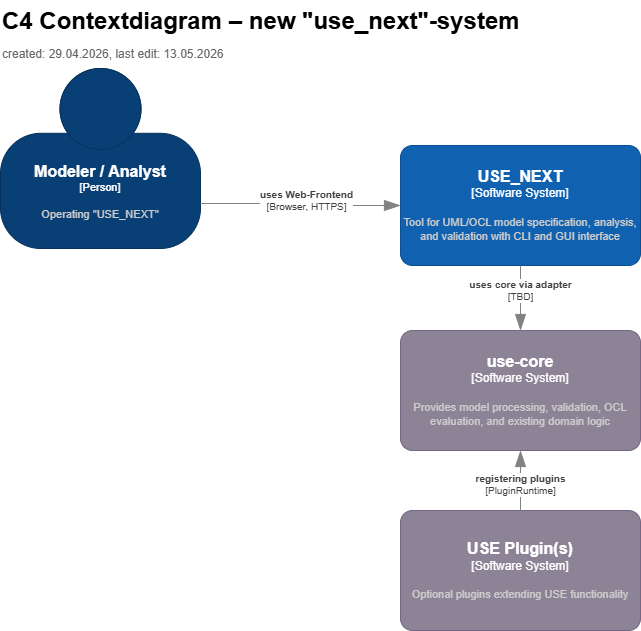

# 3. Context View

The system is operated by a modeller or analyst via a web frontend. The frontend communicates with a backend
integration layer, which in turn accesses the existing `use-core`. Optional plugins may extend the system with
additional functionality where required.

> [Architecture overview — USE_NEXT](0_architecture_overview.md)

## 3.1 Domain Context

| Element           | Description                                                                                         |
|-------------------|-----------------------------------------------------------------------------------------------------|
| Modeler / Analyst | Person who operates the system locally via the web frontend.                                        |
| **USE_NEXT**      | New frontend and integration system for UML/OCL modeling, analysis and validation with GUI and CLI. |
| `use‑core`        | Existing core system for model processing, validation, OCL evaluation and domain logic.             |
| **USE** Plugin(s) | Optional extensions that provide additional functions for USE.                                      |
