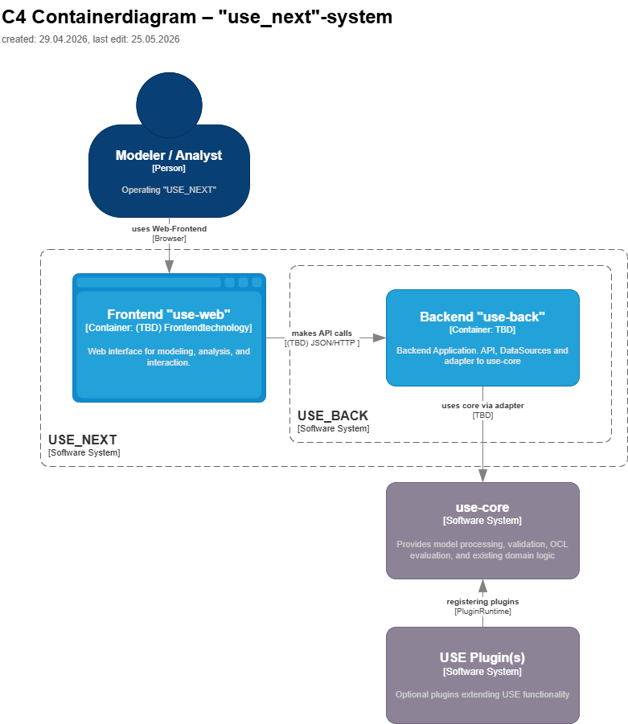

# 5. Building Block View
> [Architecture overview — USE_NEXT](0_architecture_overview.md)

| Container          | Short Description                                                                                                                                                        |
|--------------------|--------------------------------------------------------------------------------------------------------------------------------------------------------------------------|
| Frontend `use-web` | Modern Web-Frontend for model visualization, interaction and analysis control. Provides responsive UI, state management and orchestrated communication with the Backend. |
| Backend `use-back` | Integration layer for API access and connectivity to `use-core`.                                                                                                         |
| `use-core`         | Domain core for model processing, OCL evaluation, and validation.                                                                                                        |
| USE Plugin(s)      | Optional extensions for additional functionality.                                                                                                                        |